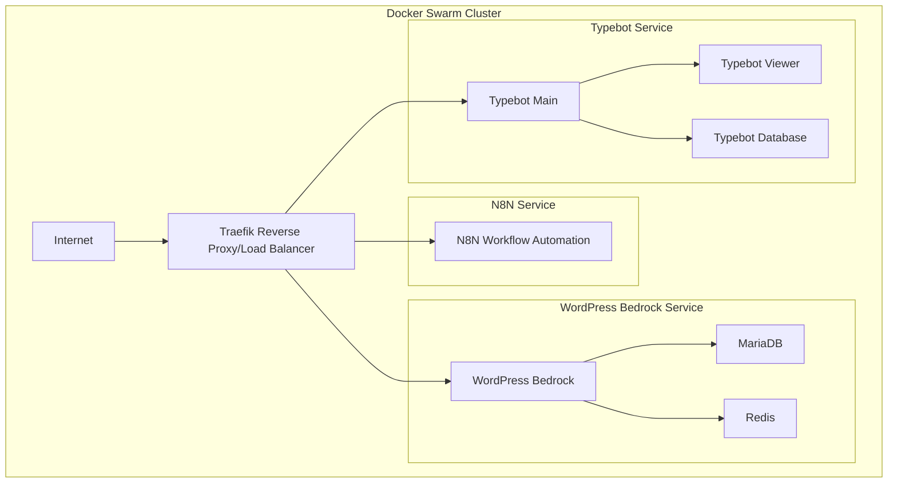

# WordPress Bedrock Docker Stack

Production-ready WordPress stack built on Bedrock, optimized for Docker Swarm deployments. Features Redis integration, multisite support, and Composer-based dependency management.

## Architecture Overview



## Stack Components

### WordPress (Bedrock-based)

- Built on PHP 8.1-FPM
- Composer-based dependency management
- Optimized PHP configuration
- Built-in health checks
- Redis object caching support
- Development and production variants

### Database Layer

- MariaDB 10.6 with master-slave replication
- Automated backup system
- Optimized for WordPress workloads
- High availability configuration

### Caching Layer

- Redis cluster for object caching
- Master-replica configuration
- Persistent storage
- Automatic failover

### Load Balancer

- Traefik 2.x
- Automatic SSL with Let's Encrypt
- HTTP/2 support
- Built-in monitoring

### Storage

- Shared NFS storage for wp-content
- Consistent content across nodes
- Backup integration

### Available Tags

- `latest`: Production-ready image
- `development-latest`: Development image with debugging tools
- `php8.1-fpm`: Specific PHP version tag

## Development Features

Development image includes:

- Xdebug support
- Query Monitor plugin
- Debug Bar plugin
- Error reporting enabled
- Node.js and npm

## Production Features

Production image includes:

- Optimized OPcache settings
- Redis object caching
- Security hardening
- Performance tuning
- Health monitoring

## Quick Start

1. Deploy the stack:

```bash
docker stack deploy -c docker-compose.yml wordpress
```

2. Scale WordPress service:

```bash
docker service scale wordpress_wordpress=3
```

3. Check service health:

```bash
docker service ls
```

## Environment Variables

```env
DB_NAME=wordpress
DB_USER=wordpress
DB_PASSWORD=your_password
DB_HOST=db
WP_ENV=production
WP_HOME=https://your-domain.com
WP_SITEURL=${WP_HOME}/wp
```

## Health Checks

The stack includes comprehensive health monitoring:

- PHP-FPM status page
- Database connection checks
- Redis connectivity
- WordPress application health

Performance Optimization

- OPcache configuration
- Redis object caching
- PHP-FPM tuning
- MariaDB optimization

## Security Features

- No root process execution
- Environment-based configuration
- Secure defaults
- Regular security updates

## Backup Strategy

- Database automated backups
- wp-content volume backups
- Point-in-time recovery capability
- Offsite backup support

## Contributing

1. Fork the repository
2. Create your feature branch
3. Commit your changes
4. Push to the branch
5. Create a new Pull Request

## License

MIT License - see LICENSE file for details

```text
This README.md provides:
1. Clear architecture visualization using Mermaid
2. Detailed component descriptions
3. Available image tags and their purposes
4. Quick start guide
5. Configuration options
6. Key features and capabilities
7. Security and performance considerations
8. Contribution guidelines
```
